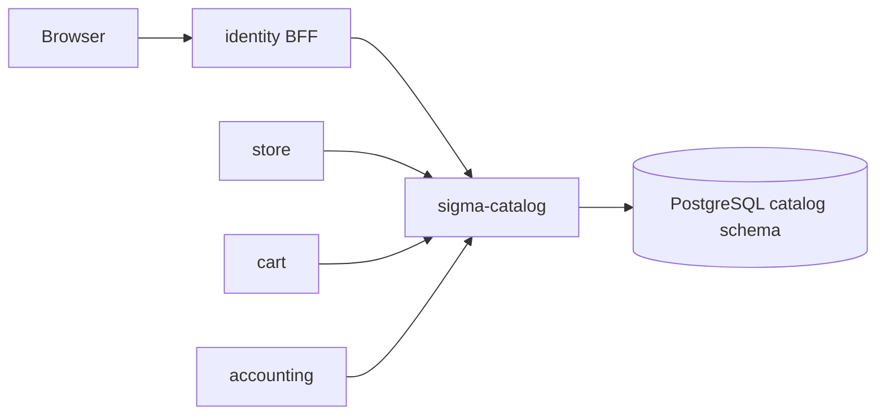

# sigma-catalog architecture

`sigma-catalog` is the product catalog for Sigma Tactical Group. It maintains SKU records and composite bill-of-materials, and exposes an admin UI plus an internal JSON API consumed by the storefront, cart, and accounting services.

## Context

This service owns the PostgreSQL `catalog` schema: `catalog.skus` and `catalog.sku_components`.

## Runtime shape

The `sigma-catalog` binary delegates to `sigma_catalog::run()`, which validates configuration, connects the catalog store to PostgreSQL, and hands `routes(store)` to `sigma_theme::warp::serve`. The theme crate supplies the Warp server, shared static assets, security headers, and the listen address from `PORT`.

SKU metadata is authoritative here; listing prices live on the store service.

## Request flow

`routes()` combines admin HTML routes from `web.rs` with JSON handlers from `api.rs`. `sigma_theme::warp::site_routes` supplies `/up`, static assets, and error recovery; health routes report database connectivity.

The web UI lists SKUs and provides create, edit, and delete forms for simple and composite items. The internal API serves `/skus` CRUD behind the internal token filter. Composite SKUs reject cycles and self-reference.

## Code map

| Path | Responsibility |
| --- | --- |
| `src/main.rs` | Delegates startup to `sigma_catalog::run()`. |
| `src/lib.rs` | Defines `run()`, assembles routes, health, theme, and CSP. |
| `src/config.rs` | Reads public URLs and the database URL. |
| `src/store.rs` | SKU and component persistence. |
| `src/model/` | SKU kinds, components, and validation. |
| `src/api.rs` | Internal-token JSON CRUD. |
| `src/web.rs` | Server-rendered admin UI. |
| `src/templates/` | Askama HTML for SKU forms and lists. |

## Data

PostgreSQL schema `catalog` holds SKU headers and component rows linking composite SKUs to their parts. Simple SKUs have no components; composite SKUs expand to child SKU references with quantities.

## Configuration

| Environment variable | Purpose |
| --- | --- |
| `PORT` | Listen port supplied to the theme crate. |
| `CATALOG_PUBLIC_BASE_URL` | Public base URL of this catalog service. |
| `CATALOG_IDENTITY_PUBLIC_URL` | Identity BFF URL for navbar links and CSP `connect-src`. |
| `CATALOG_CONTACT_PUBLIC_URL` | Contact-service URL for the shared chrome. |
| `CATALOG_CART_PUBLIC_URL` | Cart-service URL for the shared chrome. |
| `DATABASE_URL` | PostgreSQL connection URL for the shared Sigma database. |

## Deployment

`Dockerfile` produces the `sigma-catalog` image. The platform deployment is at `../platform/services/catalog/base/deployment.yaml`; it exposes container port `8080` through `../platform/services/catalog/base/service.yaml` on service port `80`.

The public VirtualService and environment overlays reside beside the base manifests under `../platform/services/catalog/`. Production hostname and platform context are documented in [`../platform/README.md`](../platform/README.md).

## Testing

Run `cargo test -p sigma-catalog`. Integration tests in `src/lib.rs` cover `/up`, simple and composite SKU API flows, web form composite creation, and CSP headers. Tests use `sigma_pg::test_helpers::ready_store`.

## Design notes

- Admin UI is intended behind the identity BFF proxy in production.
- Custom CSP allows `'unsafe-inline'` styles for SKU admin forms.
- Catalog holds product identity; store listings hold customer-facing prices.
